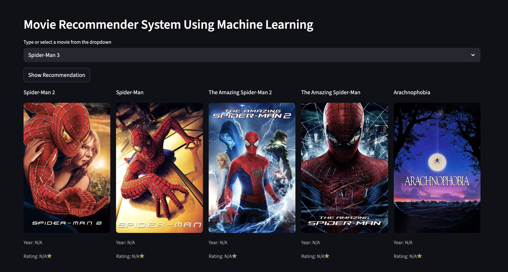
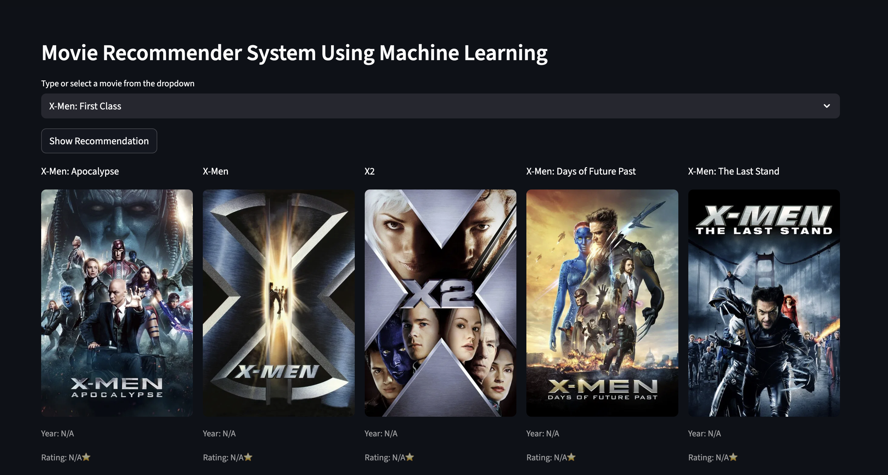
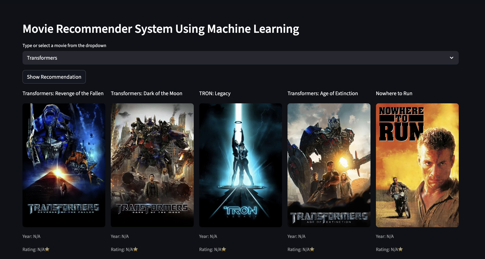

# 🎬 Movie Recommender System

## Overview

This project implements a robust and efficient movie recommendation system designed to suggest films to users based on their historical preferences, movie content, and other user ratings. The core goal is to enhance the user's movie discovery experience by providing highly personalized and relevant suggestions.

The system utilizes advanced machine learning techniques, primarily focusing on Collaborative Filtering and Content-Based methods, to deliver accurate and real-time recommendations.

## 📸 Screenshots

Here are screenshots showcasing the application's key functionalities and interface.

### 1. Main Recommendation Output Page



### 2. User Input / Selection Interface



### 3. System Architecture / Data Flow



## ✨ Features

* **Personalized Recommendations (Hybrid Approach):** Utilizes a sophisticated hybrid model to mitigate the cold-start problem and provide highly accurate suggestions by combining user rating patterns and item metadata.

* **Low-Latency Prediction:** Optimized model serialization and loading ensure fast recommendation generation (sub-second latency) for a smooth user experience.

* **Content Feature Engineering:** Implements Term Frequency-Inverse Document Frequency (TF-IDF) vectorization on movie metadata (e.g., synopsis, tags) for precise content similarity mapping.

* **Rating Persistence:** Supports user interaction through explicit movie ratings, which dynamically update the underlying user-item matrix for continuous profile learning.

* **Scalable UI:** A clean and responsive user interface built using \[Specify your Frontend, e.g., Streamlit, Flask/Jinja, React\] designed for mobile and desktop viewing.

## ⚙️ Technology Stack

| Category | Technology | Description | 
 | ----- | ----- | ----- | 
| **Language** | Python (3.8+) | Primary language for computational tasks, data pipelines, and API services. | 
| **Data Processing** | Pandas, NumPy | Utilized for high-performance manipulation and restructuring of large-scale rating and metadata matrices. | 
| **Machine Learning** | Scikit-learn, Surprise | Core libraries for implementing **Matrix Factorization** (SVD) and **Vector Space Modeling** (TF-IDF, Cosine Similarity). | 
| **Web Framework** | Streamlit | Provides the REST API or web interface for serving predictions and handling user requests. | 
| **Model Persistence** | Pickle / Joblib | Used for efficient serialization and loading of the trained recommendation model. |
| **Deployment** | \[Specify your deployment platform, e.g., Heroku, AWS, Render\] | Cloud platform used for production environment hosting and autoscaling. | 

## 🚀 Installation and Setup

Follow these steps to set up the project locally.

### Prerequisites

* Python (3.8+)
* `pip` (Python package installer)

### Step 1: Clone the Repository

```

git clone [https://github.com/dipti-2211/Movie-Recommedation.git](https://github.com/dipti-2211/Movie-Recommedation.git)
cd Movie-Recommedation

```

### Step 2: Create and Activate Virtual Environment

It is highly recommended to use a virtual environment.


### Create environment
```
python -m venv venv
```
### Activate environment (Linux/macOS)
```
source venv/bin/activate
```
### Activate environment (Windows)
```
.\\venv\\Scripts\\activate

```

### Step 3: Install Dependencies

Install all necessary Python packages from the `requirements.txt` file.

```

pip install -r requirements.txt

```

### Step 4: Run the Application

Start the web application.

```

[Specify the run command for your framework, e.g., python app.py, streamlit run main.py]

````

The application should now be running on `http://localhost:[PORT_NUMBER]`.

## 💡 Usage

1. **Launch:** Navigate to the application URL (`http://localhost:[PORT_NUMBER]`).

2. **Input:** \[Describe the initial action, e.g., Enter a movie title in the search bar or select from the dropdown.\]

3. **Process:** Click the "Recommend" button, triggering an API call to the backend prediction service.

4. **Output:** The system will display a list of the top 10 recommended movies, ranked by their predicted rating score, along with their associated \[Specify what metadata is shown, e.g., genre, year, similarity score\].

## 📊 Data Source

The project uses the **\[Specify the dataset, e.g., MovieLens 100k/1M/20M Dataset\]** dataset, which contains \[Number\] of ratings and \[Number\] movie entries.

* **Source URL:** \[Provide URL if public\]

* **Data Cleaning:** \[Briefly describe any cleaning steps, e.g., removed movies with less than 50 ratings, handled missing genres.\]

## 🧠 Recommendation Algorithm

This system utilizes a **Hybrid Recommendation Approach** to balance accuracy and coverage:

1. **Content-Based Filtering (Cold-Start Solution):**
    * **Feature Extraction:** Movie descriptions, genres, and keywords are processed using **TF-IDF vectorization**.
    * **Similarity Metric:** **Cosine Similarity** is calculated between the TF-IDF vectors to quantify the thematic and descriptive closeness of movies.
    * **Function:** Generates initial recommendations based on the features of a single selected movie.

2. **Collaborative Filtering (Matrix Factorization):**
    * **Method:** **Singular Value Decomposition (SVD)** is applied to the sparse user-item rating matrix.
    * **Mechanism:** SVD decomposes the matrix into three lower-rank matrices, effectively deriving **latent features** (or factors) that explain the relationships between users and items.
    * **Benefit:** Highly effective at capturing deep user preferences and complex taste patterns.

## 🔮 Future Enhancements

The following features are planned to further enhance the system's performance and robustness:

* **Deep Learning Models:** Integrate Neural Collaborative Filtering (NCF) models to capture non-linear user-item interactions.
* **A/B Testing Framework:** Implement a framework to test the performance of different recommendation algorithms in a production environment.
* **Temporal Dynamics:** Incorporate time-based weighting to give more importance to recent ratings, capturing shifts in user preference over time.
* **External Data Integration:** Leverage external APIs (e.g., OMDB) to enrich movie metadata and improve content-based filtering accuracy.

## 🤝 Contributing

Contributions are welcome! If you have suggestions or want to improve the project, please follow these steps:

1. Fork the repository.

2. Create a new branch (`git checkout -b feature/AmazingFeature`).

3. Commit your changes (`git commit -m 'Add some AmazingFeature'`).

4. Push to the branch (`git push origin feature/AmazingFeature`).

5. Open a Pull Request.


## ✍️ Author

GitHub - **[Dipti](https://github.com/dipti-2211)**

Portfolio - **[Dipti's Portfolio](https://dipti-singh-portfolio.vercel.app/)**

Linkdein - **[Linkdein](https://www.linkedin.com/in/dipti-singh-3b0274309/)**


---


